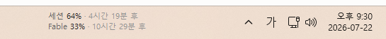

<div align="center">

# claude-taskbar-widget

**작업표시줄 위에 항상 떠 있는 Claude 사용량 게이지**

[](#)
[](#)
[](LICENSE)



작업표시줄 픽셀을 그대로 입혀서, 원래 거기 있던 것처럼 섞입니다.

</div>

## 특징

- 지금 몇 % 썼는지, 언제 풀리는지 작업표시줄만 슬쩍 봐도 압니다. 세션·주간·모델별로 60초마다 새로 받아옵니다.
- 매일 로그인할 필요가 없습니다. `claude setup-token`으로 받은 12개월짜리 토큰을 위젯이 알아서 찾아 씁니다.

## 설치

PowerShell을 열고 아래 한 줄을 붙여넣으세요. 다운로드와 설치를 알아서 진행합니다.

```powershell
irm https://raw.githubusercontent.com/KimJinWooDa/claude-taskbar-widget/main/install.ps1 | iex
```

설치가 끝나면 두 가지만 하면 됩니다.

1. 터미널에 출력된 JSON을 복사해 `~/.claude/settings.json` (`C:\Users\<사용자이름>\.claude\settings.json`)에 붙여넣기 — Claude Code를 켤 때 위젯이 같이 켜지게 하는 설정입니다.
2. 터미널에서 `claude setup-token` 한 번 실행 — 브라우저에서 승인하면 12개월짜리 토큰이 발급되고, 위젯이 알아서 등록합니다.

끝입니다. 다음 Claude Code 실행부터 위젯이 함께 뜹니다. 바로 보고 싶으면 설치 폴더의 `run-widget.vbs`를 더블클릭하세요.

<details>
<summary>git으로 직접 받고 싶다면</summary>

```powershell
git clone https://github.com/KimJinWooDa/claude-taskbar-widget
cd claude-taskbar-widget
.\install.ps1
```

</details>

<details>
<summary>PowerShell 실행이 차단되는 경우</summary>

```powershell
Set-ExecutionPolicy -Scope Process -ExecutionPolicy Bypass
.\install.ps1
```

</details>

## 사용법

| 기능 | 방법 |
|---|---|
| 이동 | 바를 드래그하면 위치가 저장됩니다. |
| 숨기기 / 표시 | 바 우클릭, 또는 트레이 아이콘 메뉴. |
| 위치 잠금 | 트레이 메뉴 `바 위치 잠금` — 클릭이 작업표시줄로 통과합니다. |
| 수동 토큰 등록 | 토큰을 복사한 뒤 트레이 메뉴 `장수 토큰 등록 (클립보드에서)`. |
| 로그 | `%APPDATA%\ClaudeUsageWidget\widget.log` |

## 문제 해결

<details>
<summary>위젯이 안 보여요</summary>

트레이 오버플로(^) 안에 아이콘이 있는지 확인하고, 메뉴에서 `플로팅 바 표시`를 켜세요. Claude가 꺼져 있으면 위젯도 함께 종료됩니다.

</details>

<details>
<summary>위젯 위치가 움직이지 않아요</summary>

트레이 메뉴에서 `바 위치 잠금`을 해제한 뒤 드래그하세요.

</details>

<details>
<summary>숫자 대신 빨간 문구가 떠요</summary>

인증이 만료된 상태입니다. 터미널에서 `claude setup-token`을 실행하면 자동으로 복구됩니다.

</details>

---

<div align="center">

Anthropic과 무관한 비공식 도구입니다.

토큰은 사용자 PC에만 저장되며 Anthropic 공식 API로만 전송됩니다.

[MIT License](LICENSE)

</div>
