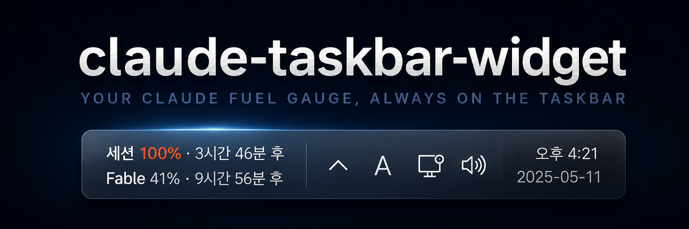

<div align="center">



<br>

[](#)
[](#)
[](LICENSE)

<br><br>

세션·모델별 Claude 주간 사용량을 Windows 작업표시줄 위에 표시하는 위젯입니다.

</div>

## 설치

PowerShell에서 아래 명령어를 순서대로 실행하세요.

```powershell
git clone https://github.com/KimJinWooDa/claude-taskbar-widget
cd claude-taskbar-widget
.\install.ps1
```

설치 스크립트가 실행되면 Claude Code 설정에 추가할 JSON 내용이 터미널에 출력됩니다.

출력된 내용을 아래 경로의 `settings.json` 파일에 붙여넣으세요.

```text
C:\Users\<사용자이름>\.claude\settings.json
```

설정이 완료되면 이후 Claude Code를 실행할 때 위젯도 함께 실행됩니다.

바로 실행하려면 프로젝트 폴더의 `run-widget.vbs`를 더블클릭하세요.

### PowerShell 실행이 차단되는 경우

아래 명령어를 먼저 실행한 뒤 설치를 다시 시도하세요.

```powershell
Set-ExecutionPolicy -Scope Process -ExecutionPolicy Bypass
.\install.ps1
```

## 사용방법

| 기능 | 설명 |
|---|---|
| 이동 | 위젯 바를 드래그하면 위치가 자동으로 저장됩니다. |
| 숨기기 / 표시 | 위젯을 우클릭하거나 시스템 트레이 아이콘 메뉴에서 전환할 수 있습니다. |
| 위치 잠금 | 트레이 메뉴의 `바 위치 잠금`을 켜면 클릭이 작업표시줄로 통과합니다. |
| 전체화면 동작 | 게임이나 영상을 전체화면으로 실행하면 작업표시줄과 함께 숨겨집니다. |
| 자동 종료 | `claude.exe` 종료 약 10초 후 위젯도 자동으로 종료됩니다. |
| 로그 확인 | `%APPDATA%\ClaudeUsageWidget\widget.log` |

## 설정 파일 위치

Claude Code 설정 파일은 일반적으로 아래 위치에 있습니다.

```text
C:\Users\<사용자이름>\.claude\settings.json
```

`~`는 현재 Windows 사용자의 홈 폴더를 의미합니다.

따라서 아래 두 경로는 같은 의미입니다.

```text
~/.claude/settings.json
C:\Users\<사용자이름>\.claude\settings.json
```

## 자주 묻는 질문

### JSON이 뭔가요?

JSON은 프로그램 설정을 저장하는 텍스트 형식입니다.

직접 내용을 작성할 필요 없이 설치 스크립트가 출력한 내용을 복사해서 `settings.json`에 붙여넣으면 됩니다.

### 위젯을 바로 실행하려면 어떻게 하나요?

프로젝트 폴더에 있는 아래 파일을 더블클릭하세요.

```text
run-widget.vbs
```

### 위젯이 보이지 않아요

시스템 트레이의 숨겨진 아이콘 메뉴를 열고 Claude Usage Widget 아이콘이 실행 중인지 확인하세요.

트레이 메뉴에서 위젯 표시 상태를 변경할 수 있습니다.

### 위젯 위치가 움직이지 않아요

트레이 메뉴에서 `바 위치 잠금`이 활성화되어 있는지 확인하세요.

위치를 변경하려면 잠금을 해제한 뒤 위젯 바를 드래그하세요.

### 로그 파일은 어디에 있나요?

```text
%APPDATA%\ClaudeUsageWidget\widget.log
```

파일 탐색기 주소창에 위 경로를 입력하면 로그 파일이 있는 폴더로 이동할 수 있습니다.

---

<div align="center">

Anthropic과 무관한 비공식 도구입니다.

토큰은 사용자 PC에만 저장되며 Anthropic 공식 API로만 전송됩니다.

[MIT License](LICENSE)

</div>